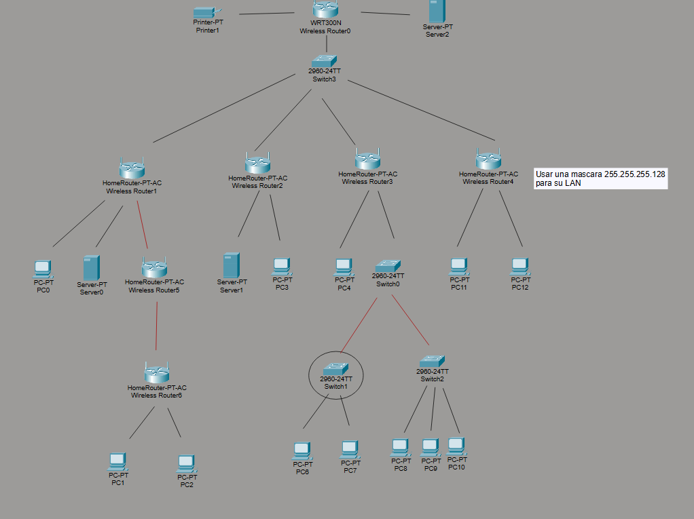

# Examen Unidad 1
## Direccionamiento IP, Clases y Segmentos
### Usando la herramiento Packer Tracer Cofigurar los equipo mediante la siguientes especificaciones:

1) Realiza las conexiones necesarias para esta topologia

### Notas:
Las lineas negras son clables directos
Las lineas rojas son crossover
El circulo es una Vlan

2) Realizar las cofiguraciones de Direcciones IP para cada router y equipo
Las condiciones son:
 2.1  Todos los equipos ecepto los que estan en una vlan podran conectarse al servidor e impresora del nivel más alto.
 2.2 el trafico de cada red sera administrado por cada uno de los routers, tu especificas el servidor DHCP y los grupos de direcciones en Gateway
 2.3 Todos los servidores web deberan tener una pagina personalizada donde especifiquen en que red se encuentran, esto para diferenciar el acceso.
 2.4 La red 4 tiene una nota se debe cambiar la mascara de red 255.255.255.0 por una 255.255.255.128

3) Generar un documento donde se explique el digrama de direcciones empleado para este examen, entregar en formaro MD adjunto con el archivo en un zip.

Puedes ocupar este formato.
